# Laporan Praktikum Dasar Pemrograman Jobsheet 5 Pemilihan

<h4>Nama : Muhammad Ferdi Afiyanto<h4>
<h4>NIM : 254107020122<h4>
<h4>Kelas : TI-1E<h4>

## 2.1 Pemilihan

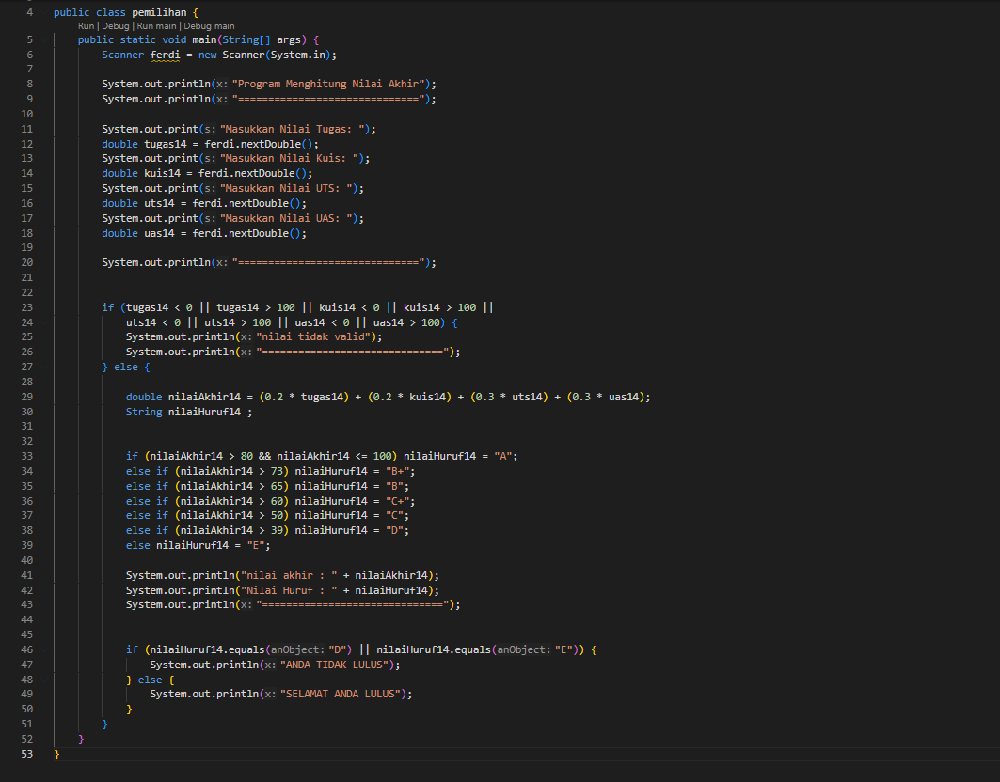  

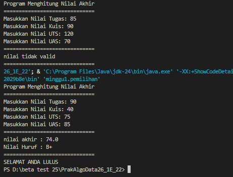  

## 2.2 Perulangan

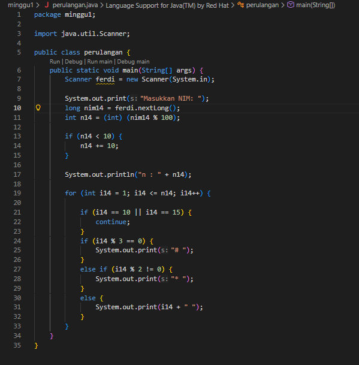  

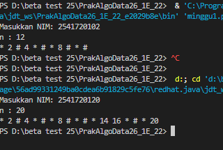  

## 2.3 Array

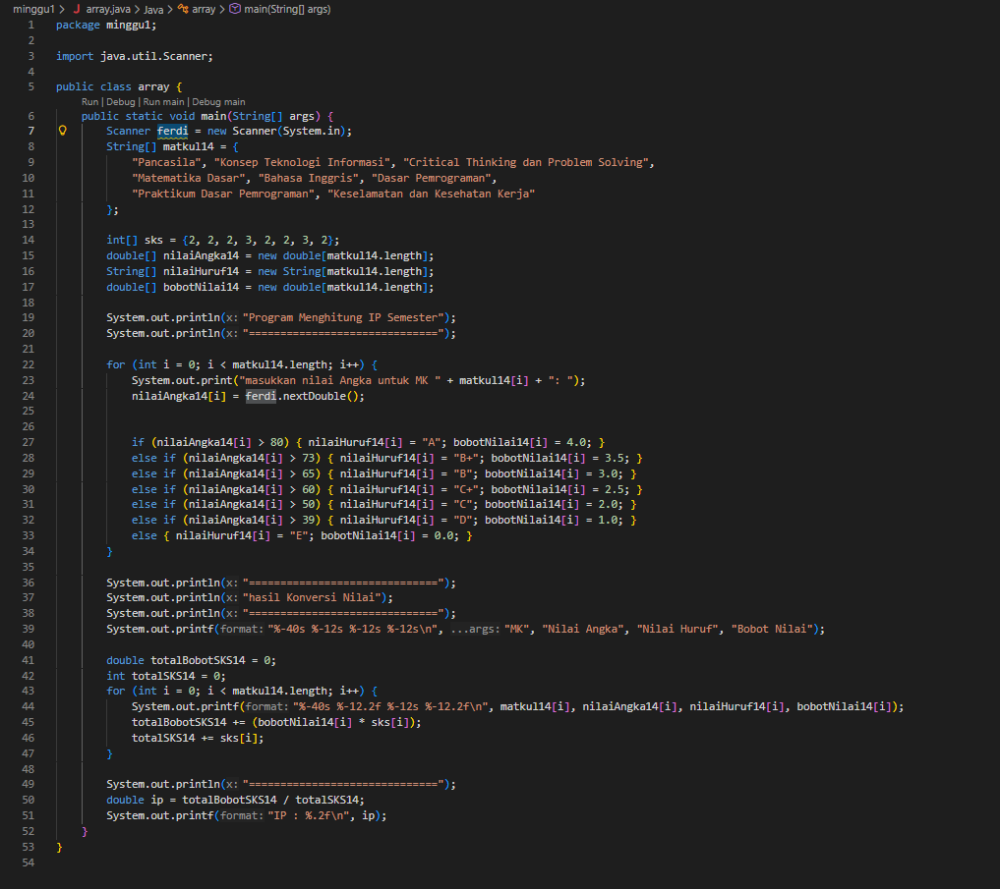  

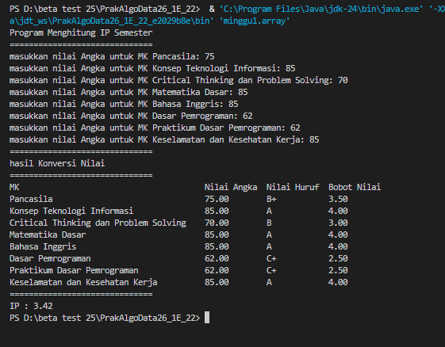  

## 2.4 Fungsi

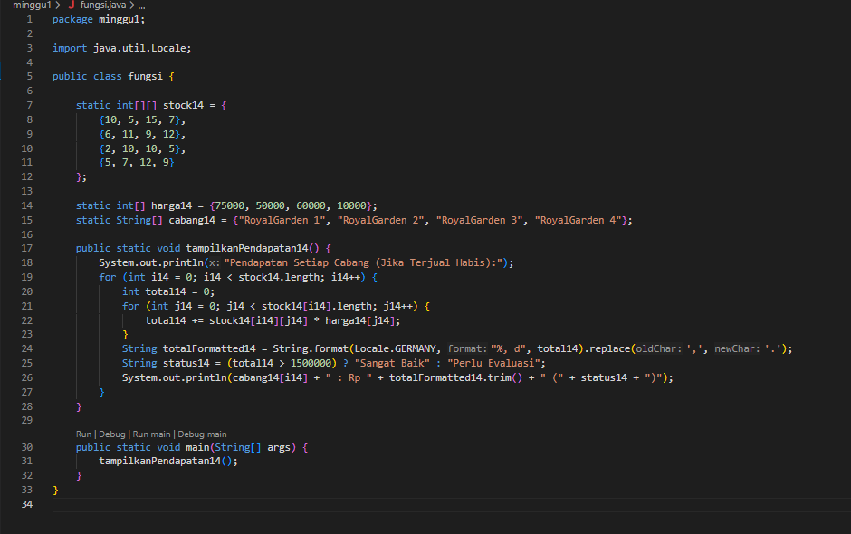  

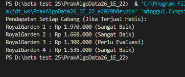  

## Tugas 1 
- Berikut hasil array plat nomor:

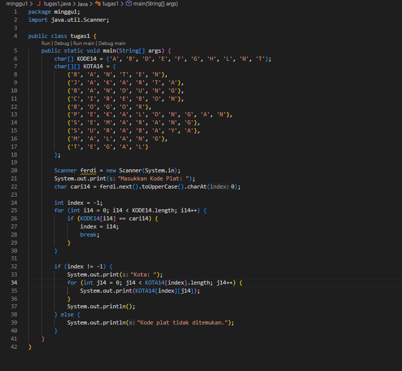  

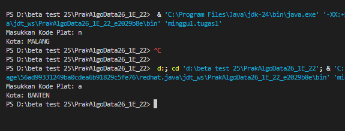  

## Tugas 2 
- Berikut hasil program data jadwal kuliah:
 
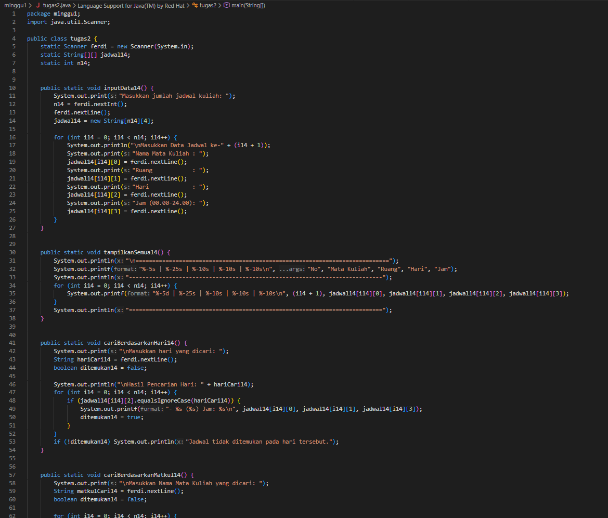  

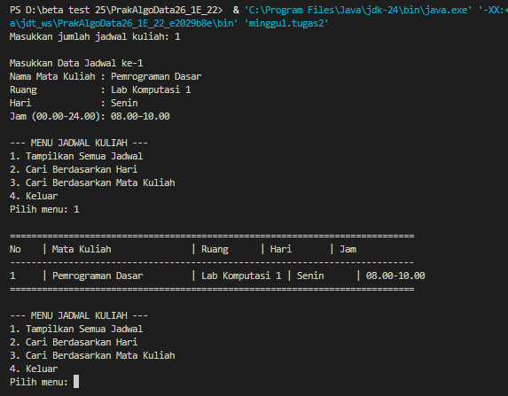  

