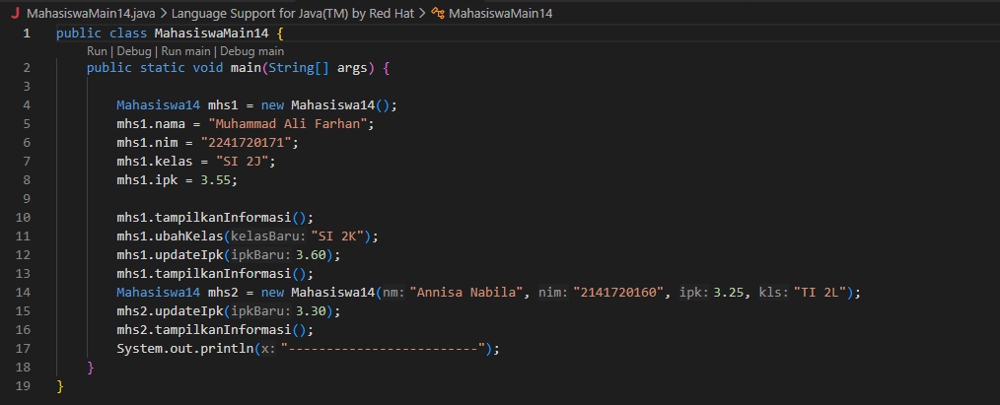
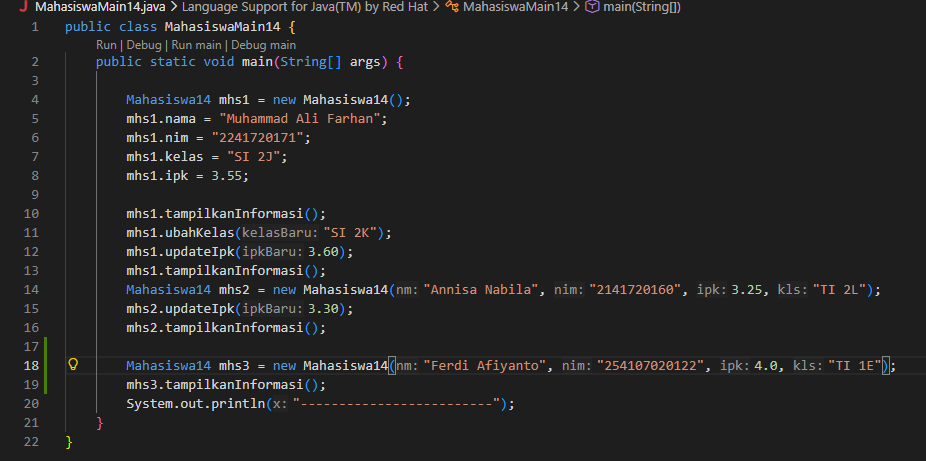

# Laporan Praktikum Dasar Pemrograman Jobsheet 2

<h4>Nama : Muhammad Ferdi Afiyanto<h4>
<h4>NIM : 254107020122<h4>
<h4>Kelas : TI-1E<h4>

## 2.1 Deklarasi Class, Atribut dan Method

 1](images/c6477828d02f30fbd6814d7aa93a0a2e610d918b9909ccafea8e611ac469992a.png)  

1. Dua karakteristik class atau object: Class merupakan blueprint atau cetakan, sedangkan Object adalah instance (wujud nyata) dari class tersebut di dalam memori yang memiliki state (atribut) dan behavior (method).

2. Atribut class Mahasiswa: Ada 4 atribut , yaitu nama, nim, kelas, dan ipk

3. Method class Mahasiswa: Ada 4 method , yaitu tampilkanInformasi(), ubahKelas(), updateIpk(), dan nilaiKinerja()

4. Line 28 -34

5. Method class Mahasiswa: Ada 4 method , yaitu tampilkanInformasi(), ubahKelas(), updateIpk(), dan nilaiKinerja()

## 2.2 Instansiasi Object, serta Mengakses Atribut dan Method

  

  

## 2.3 Membuat Konstruktor
- Gambar ada di 2.1

1. Line 6 - 15 pada MahasiswaMain14.java
2. Baris ini melakukan instansiasi objek bernama mhs2 sekaligus memberikan nilai awal pada atribut-atributnya secara langsung memanfaatkan parameter yang dikirim ke konstruktor
3. terjadi Error karena pada MahasiswaMain14, objek mhs1 di-instansiasi dengan pemanggilan konstruktor kosong (new Mahasiswa14()). Java hanya menyediakan konstruktor default otomatis jika tidak ada konstruktor lain yang dibuat. Karena kita sudah membuat konstruktor berparameter, kita wajib menuliskan konstruktor default secara eksplisit
4. Tidak, method tidak harus diakses secara berurutan. Pemanggilan method disesuaikan dengan kebutuhan alur logika program yang sedang kita buat
5.   

## Tugas 1 
- Berikut hasil array plat nomor:

## Tugas 2 
- Berikut hasil program data jadwal kuliah:
 