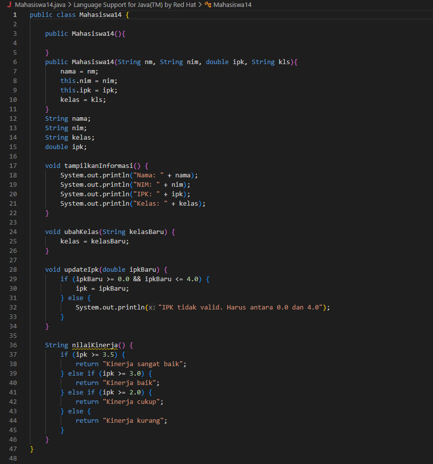
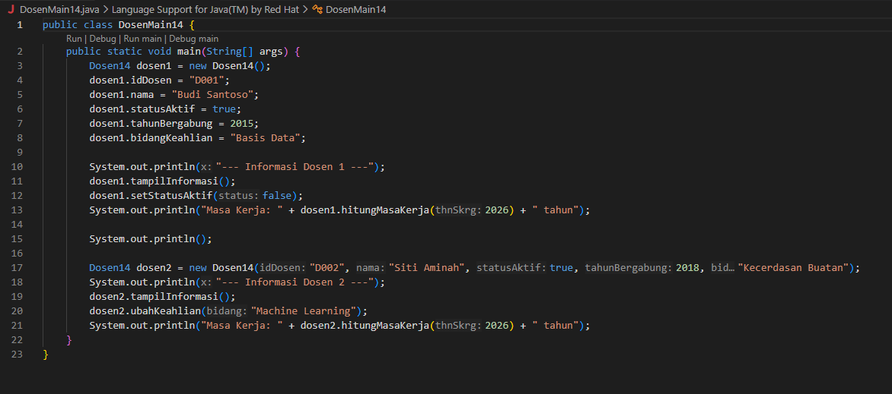
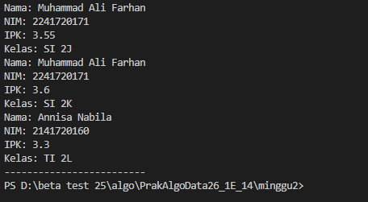

# Laporan Praktikum Dasar Pemrograman Jobsheet 2

<h4>Nama : Muhammad Ferdi Afiyanto<h4>
<h4>NIM : 254107020122<h4>
<h4>Kelas : TI-1E<h4>

## 2.1 Deklarasi Class, Atribut dan Method

 1](images/5ca738b528e33556f9db88dbadbe56da215faadcea3ec98326d66cfb8fbfc01a.png)  

  

  

1. Dua karakteristik class atau object: Class merupakan blueprint atau cetakan, sedangkan Object adalah instance (wujud nyata) dari class tersebut di dalam memori yang memiliki state (atribut) dan behavior (method).

2. Atribut class Mahasiswa: Ada 4 atribut , yaitu nama, nim, kelas, dan ipk

3. Method class Mahasiswa: Ada 4 method , yaitu tampilkanInformasi(), ubahKelas(), updateIpk(), dan nilaiKinerja()

4. Line 28 -34

5. Method class Mahasiswa: Ada 4 method , yaitu tampilkanInformasi(), ubahKelas(), updateIpk(), dan nilaiKinerja()

## 2.2 Instansiasi Object, serta Mengakses Atribut dan Method
  

## 2.3 Membuat Konstruktor

## Tugas 1 
- Berikut hasil array plat nomor:

## Tugas 2 
- Berikut hasil program data jadwal kuliah:
 